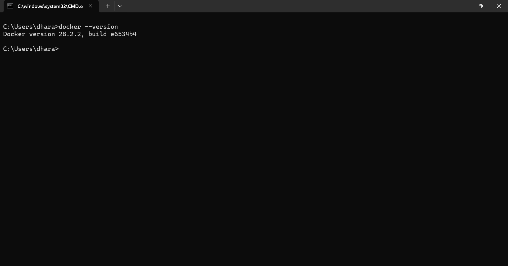
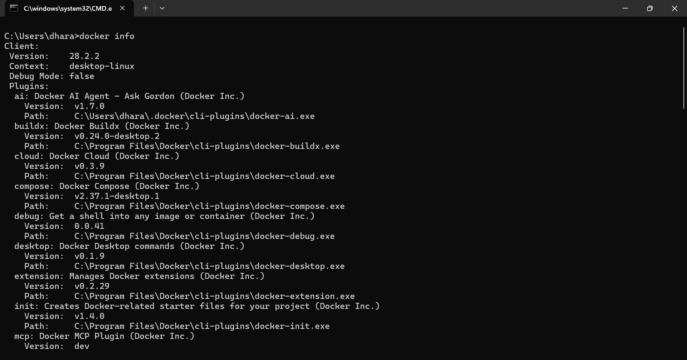
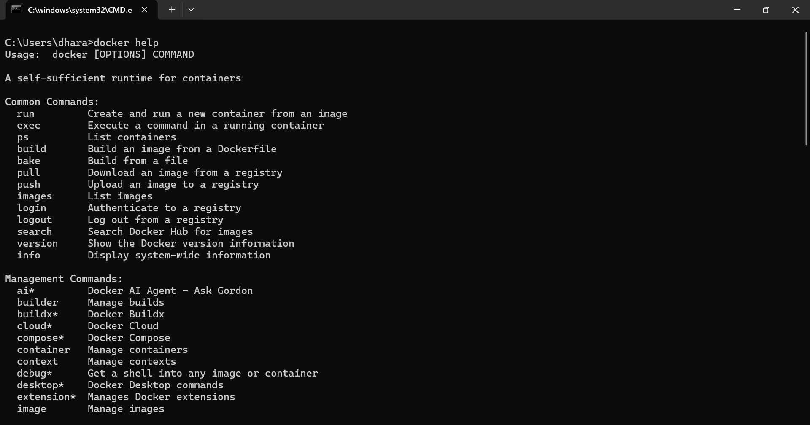

                                                     DOCKER GENERAL COMMANDS
 
👉 docker --version ➡️ it shows the version of the docker

👉 docker info ➡️ it shows docker plugins, version and the servers, containers and their status, images, swarm, CPU's and IP, etc..

👉 docker help ➡️ throughout this we can able to view the commands available for the management perspective also for swarm, container and every features available to make the docker engine to help in containerisation.

👉 docker ps ➡️ this will show us the process status like containers running and images which are in active the container id etc.

